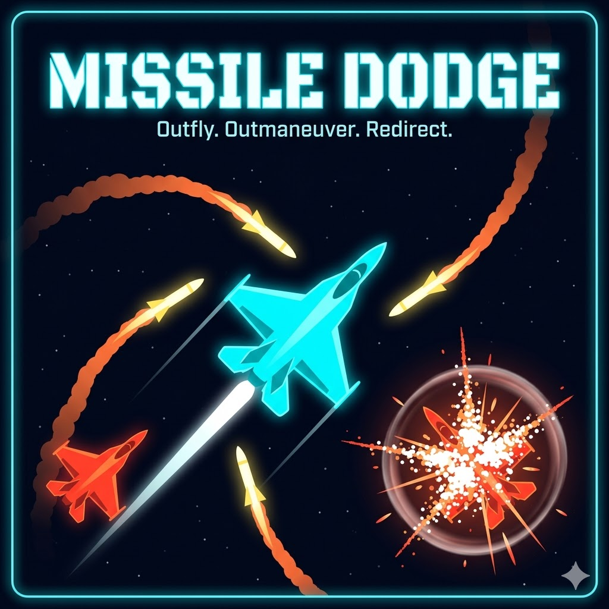

# MISSILE DODGE



A browser-based arcade survival game where you pilot an unarmed jet, dodging homing missiles fired by enemy jets and maneuvering so the missiles destroy the enemies instead. The core fantasy: you're outgunned but never outsmarted.

Play [here](https://missiledodge.srikardurgi.com/).

**This project is fully vibe-coded with [Claude Code](https://claude.ai/claude-code) — every line of code was generated through AI-assisted development with zero hand-written code.**

## Play

Open `index.html` in any modern browser. No build step, no dependencies, no installation.

## Controls

| Input | Desktop | Mobile |
|---|---|---|
| Move | Arrow Keys / WASD | Virtual Joystick (drag anywhere) |
| Afterburner | Spacebar | Tap BOOST button |
| Pause | P / Escape | Tap pause icon |

## Technical Overview

### Architecture

Single-file HTML/CSS/JavaScript application (~1400 lines). Everything runs on a `<canvas>` element using the 2D rendering context. No frameworks, no external assets, no build tooling — fully self-contained and portable.

### Rendering

- **Canvas 2D** with `requestAnimationFrame` game loop
- **Delta-time physics** — all movement and timers are frame-rate independent
- **Procedural graphics** — all jets, missiles, and effects are drawn with canvas path operations (no sprites or images)
- **Particle system** — lightweight particle pool (capped at 200) handles engine trails, missile smoke, explosions, and sparks
- **Screen shake** — canvas translation offset on explosions, intensity scales with explosion size

### Physics & Gameplay

- **Momentum-based movement** — player accelerates in input direction with friction decay (0.98/frame), speed-capped with smooth rotation interpolation
- **Homing missiles** — track player position with limited turn rate (not predictive). Turn rate varies by enemy type. Missiles that survive 8+ seconds get a 50% turn rate boost to prevent infinite orbiting
- **Missile deflection** — missiles passing within a configurable radius of enemies experience gravitational pull toward them, bending their trajectory. Pull strength scales inversely with distance
- **Wall bouncing** — missiles reflect off arena edges (angle of incidence = angle of reflection) and continue tracking, preventing trivial wall kills
- **Circle-circle collision** — all hitboxes are circular with radii smaller than visual size (~70%) for satisfying near-misses
- **Afterburner** — 2x speed burst for 0.8s with 3s cooldown, shown as a radial progress indicator

### Enemy AI

Three enemy types with distinct behaviors, introduced progressively across waves:

| Type | HP | Behavior | Missile Style |
|---|---|---|---|
| **Scout** | 1 | Fast, strafes laterally at ~300px range | Slow turn rate, single missile every 4s |
| **Gunship** | 2 | Orbits at ~250px, backs off if rushed | Medium turn rate, single missile every 3s |
| **Bomber** | 3 | Slow passes curving toward player at ~350px | Slow turn rate but faster speed, dual spread missiles every 5s |

Enemies actively maintain engagement range — they close distance when far, orbit/strafe when in range, and curve back if they overshoot screen bounds.

### Difficulty System

Three difficulty presets affecting missile speed, deflection mechanics, lives, and score multiplier:

| Setting | Missile Speed | Deflection Radius | Lives | Score |
|---|---|---|---|---|
| Easy | 0.75x | 65px (wide) | 5 | 0.5x |
| Normal | 1.0x | 45px | 4 | 1.0x |
| Hard | 1.3x | 30px (tight) | 3 | 1.5x |

High scores are tracked separately per difficulty in `localStorage`.

### Scoring

- Base points: Scout 100, Gunship 250, Bomber 500
- **Combo system**: kills within 3s of each other build a multiplier (max 5x)
- **Redirect bonus**: +50 when a missile destroys the enemy that fired it
- **Near miss**: +25 when a missile passes within 20px of the player without hitting

### Wave System

Continuous wave-based progression with ~20s waves. Enemy count and type mix escalate through wave 10, then plateau. Fire rates decrease and missile speeds increase with wave number. 2-second breather between waves.

### Input Handling

- Keyboard events with key state tracking (supports simultaneous keys)
- Full multi-touch support: virtual joystick (drag anywhere) + boost button with independent touch IDs
- Touch UI only renders on touch-capable devices
- Viewport locked to prevent pinch-zoom and scroll on mobile

### State Machine

```
MENU → DIFFICULTY_SELECT → PLAYING ↔ PAUSED
                              ↓
                          GAME_OVER → DIFFICULTY_SELECT
```

## Visual Style

Dark neon-military aesthetic — radar screen meets arcade. Deep navy-black background (`#0a0e1a`) with cyan player jet, red-orange enemies, yellow-white missiles with orange trails, and white-to-orange explosions with expanding ring effects. Scrolling star field conveys motion. Subtle cyan border glow marks arena edges.

## Development

This entire game was built through conversational AI development using Claude Code. Features were iteratively added through natural language prompts — from the initial game spec through mobile controls, difficulty settings, missile deflection mechanics, and visual polish.

To run a local dev server:

```bash
python3 -m http.server 8080
```

Then open `http://localhost:8080` in your browser.

## License

MIT
